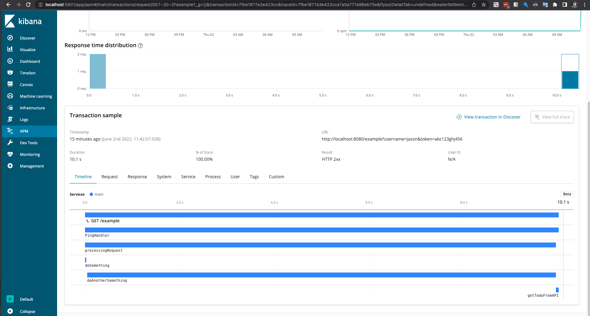

# Elastic APM - Go Example

## Setup

```bash
docker-compose up -d
go mod init example.com/m
go mod tidy
go run main.go
```

## Example request

```
curl http://localhost:8080/example?username=jason&token=abc123ghj456
```

then check the APM section from Kibana.




as you can see the `doAnotherSomething` span takes 10 second.

```go
func doAnotherSomething(ctx context.Context) {
	span, ctx := apm.StartSpan(ctx, "doAnotherSomething", "custom")
	defer span.End()

	// time sleep simulate some processing time
	time.Sleep(10 * time.Second)
	return
}
```